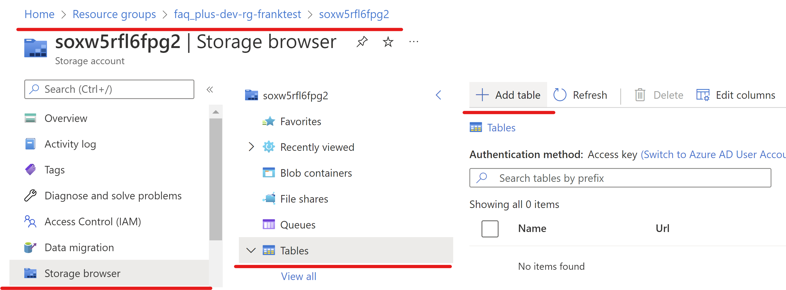
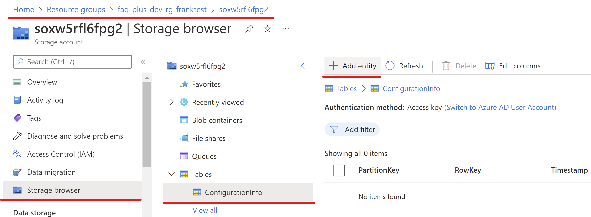

## Prerequisites

To begin, you will need: 

* An Azure subscription where you can create the following kind of resources:
	* App service
	* App service plan
	* Bot channels registration
	* Azure storage account
	* Azure cognitive search
	* Azure function
	* QnA Maker cognitive service
	* Application Insights  
* A team in Microsoft Teams with your group of experts. (You can add and remove team members later!)
* A reasonable set of Question and Answer pairs to set up the knowledge base for the bot.

## Step 1: Register Azure AD applications

Register one Azure AD applications in your tenant's directory for the configuration app.

1. Log in to the Azure Portal for your subscription, and go to the ["App registrations" blade](https://portal.azure.com/#blade/Microsoft_AAD_IAM/ActiveDirectoryMenuBlade/RegisteredApps).

2. Click on "New registration", and create an Azure AD application.
	1. **Name**: The name of your configuration app. We advise appending “Configuration” to the name of this app; for example, “FAQ Plus Configuration”.
	2. **Supported account types**: Select "Account in this organizational directory only"
	3. Leave the "Redirect URL" field blank for now.

3. Click on the "Register" button.

4. When the app is registered, you'll be taken to the app's "Overview" page. Copy the **Application (client) ID** and **Directory (tenant) ID**; we will need it later. Verify that the "Supported account types" is set to **My organization only**.

We recommend that you copy these values into a text file, using an application like Notepad. We will need these values later.


5. Open `.fx/configs/azure.parameters.{envName}.json`

6. Fill in the following values:

     1. **configAppClientId**: the **Application (client) ID** you saved in Step 4.

     2. **configAppTenantId**: the **Directory (tenant) ID** you saved in Step 4.

     3. **configAdminUPNList**: a semicolon-delimited list of users who will be allowed to access the configuration app.
         * For example, to allow Megan Bowen (meganb@contoso.com) and Adele Vance (adelev@contoso.com) to access the configuration app, set this parameter to `meganb@contoso.com;adelv@contoso.com`.

## Step 2: Configure Azure AD application

*Note: You need to run `Teams: Provision in the cloud` first before configuring the Azure AD app. If you have not run the command yet, please go back to the [ReadMe](../README.md#try-the-sample) and follow the steps.*

1. Open `.fx\states\state.{envName}.json`, and note the **resourceNameSuffix** under `solution`.
1. Open `.fx/configs/azure.parameters.{envName}.json`, copy the **resourceBaseName** and replace `{{state.solution.resourceNameSuffix}}` with **resourceNameSuffix** saved above; we will need it later.

1. Note the location of the configuration app that you deployed is "https://[resourceBaseName]-config.azurewebsites.net". For example, if you chose "contosofaqplus" as the base name, the configuration app will be at "https://contosofaqplus-config.azurewebsites.net".

1. Go back to the [App Registrations page](https://portal.azure.com/#blade/Microsoft_AAD_IAM/ActiveDirectoryMenuBlade/RegisteredAppsPreview).

1. Click on the configuration app in the application list. Under "Manage", click on "Authentication" to bring up authentication settings.

1. Click on Add a platform, select Web.


1. Add new entry to "Redirect URIs":
	If your configuration app URL is https://contosofaqplus-config.azurewebsites.net, then add the following entry as the Redirect URIs:
	- https://contosofaqplus-config.azurewebsites.net

	Note: Please refer to Step 3.1 for more details about the URL. 

1. Under "Implicit grant", check "ID tokens" and "Access tokens". The reason to check "ID tokens" is because you are using only the accounts on your current Azure tenant and using that to authenticate yourself in the configuration app. Click configure.


1. Add new entries to "Redirect URIs":
	If your configuration app's URL is https://contosofaqplus-config.azurewebsites.net, then add the following entry as the Redirect URIs:
	- https://contosofaqplus-config.azurewebsites.net/signin
	- https://contosofaqplus-config.azurewebsites.net/configuration


1. Click "Save" to commit your changes.

## Step 3: Create the QnA Maker knowledge base

*Note: You need to run `Teams: Provision in the cloud` first before creating the QnA Maker knowledge base. If you have not run the command yet, please go back to the [ReadMe](../README.md#try-the-sample) and follow the steps.*

Create a knowledge base on the [QnA Maker portal](https://www.qnamaker.ai/Create), following the instructions in the QnA Maker documentation [QnA Maker documentation](https://docs.microsoft.com/en-us/azure/cognitive-services/qnamaker/tutorials/create-publish-query-in-portal#create-a-knowledge-base).

Skip the step 1 "Create a QnA service in Microsoft Azure", because the ARM template that you deployed in Step 2 "Deploy to your Azure subscription" already created the QnA service. Proceed directly to the next step, "Connect your QnA service to your KB".

Use the following values when connecting to the QnA service:

* **Microsoft Azure Directory ID**: The tenant associated with the Azure subscription selected in Step 2.1.
* **Azure subscription name**: The Azure subscription to which the ARM template was deployed.
* **Azure QnA service**: The QnA service was created during the deployment. This is the same as the "Base resource name"; for example, if you chose "contosofaqplus" as the base name, the QnA Maker service will be named `contosofaqplus`.


After [publishing the knowledge base](https://docs.microsoft.com/en-us/azure/cognitive-services/qnamaker/tutorials/create-publish-query-in-portal#publish-to-get-knowledge-base-endpoints), note the knowledge base ID (see screenshot).


Remember the knowledge base ID: we will need it in the next step.

## Step 4: Finish configuring the FAQ Plus app

*Note: You need to run `Teams: Provision in the cloud` first before finishing the FAQ Plus app. If you have not run the command yet, please go back to the [ReadMe](../README.md#try-the-sample) and follow the steps. If you encounter the following error page, please refer to [this workaround](#workaround-for-configuration-app-error-page) for a solution.*


1. Open the configuration app by typing your confirguration app url "https://[resourceBaseName]-config.azurewebsites.net" in browser. For example, if you chose "contosofaqplus" as the base name, the configuration app url will be "https://contosofaqplus-config.azurewebsites.net".

2. You will be prompted to log in with your credentials. Make sure that you log in with an account that is in the list of users allowed to access the configuration app.


3. Get the link to the team with your experts from the Teams client. To do so, open Microsoft Teams, and navigate to the team. Click on the "..." next to the team name, then select "Get link to team".


Click on "Copy" to copy the link to the clipboard.


4. Paste the copied link into the "Team Id" field, then press "OK".


5. Enter the QnA Maker knowledge base ID into the "Knowledge base ID" field, then press "OK".

### Notes

Remember to click on "OK" after changing a setting. To edit the setting later, click on "Edit" to make the text box editable.

### Workaround for configuration app page error

Here is a workaround to replace the step 4.

1. Create a configuration table in your AAD Storage Instance. The table name must be **ConfigurationInfo**.



2. After creating the configuration table, click **Add Entity**


	
3. Edit the configuration table to add Team ID and Knowledge base ID: (PartitionKey=ConfigurationInfo, RowKey=KnowledgeBaseId/TeamId). The property name of data should be "**Data**".

(i)	If you want to insert a KnowledgeBaseId, then set RowKey= KnowledgeBaseId 


(ii)	You need to use the following **C#** code snippet to trans your raw **team link** string to a storable one.

```cs
using System.Text.RegularExpressions;
using System.Web;
public class Example {
   public static void Main() {
      var teamIdDeepLink = "<YOUR_TEAM_LINK>"; // For example: "https://teams.microsoft.com/l/team/19%3a9M4Dz_-DQsKsqV0MfFjmpRz4Np0dcidgmIv6OkWGMwM1%40thread.tacv2/conversations?groupId=fee6b738-335e-4882-9105-92c9fd6d71c6&tenantId=72f988bf-86f1-41af-91ab-2d7cd011db47"
      var match = Regex.Match(teamIdDeepLink, @"teams.microsoft.com/l/team/(\S+)/");

      Console.Write(HttpUtility.UrlDecode(match.Groups[1].Value));
   }
}
```
After run the code above, you'll get a string in your terminal like this (the green string):


Then go to Azure portal, find the storage table in your resource group, and add a new entity. Set RowKey=TeamId, Data=<the_green_string_above>


## Step 5: Prepare required parameters for Teams Bot app

1. Go to Azure portal, open the resource group you created during deployment in step 2.4 on this page.

2. Click and open the Azure Storage instance in the resource group, then click **Access keys** in left panel.

3. Click **Show keys** button, then copy the connection string of either key1 or key2. Record the value to your notebook and name it `StorageConnectionString`.

4. Go to the resource group again and click to open the QnA maker instance. The service name is the same as the "Base resource name" you specified during provision.

5. Click **Keys and Endpoint** in left panel, then click **Show Keys** button.

6. Copy the value of either KEY 1 or KEY 2. Record it to your notebook and name it `QnAMakerSubscriptionKey`

7. Copy the value of endpoint URL. Record it to your notebook and name it `QnAMakerApiEndpointUrl`.

8. The last parameter you will use is `QnAMakerHostUrl`. It should be "https://[resourceBaseName]-qnamaker.azurewebsites.net". 
Remember to replace the resourceBaseName, for example, if you chose "contosofaqplus" as the base name, your url will be "https://contosofaqplus-qnamaker.azurewebsites.net".
 
Now you will have following parameters ready on your notebook. You can go back to [readme](../README.md) and follow the instructions to config and run your app.
| Name | Example |
| ---- | ---- |
| StorageConnectionString | DefaultEndpointsProtocol=https;AccountName=[AccountName];AccountKey=[Key] |
| QnAMakerApiEndpointUrl | https://[Location].api.cognitive.microsoft.com |
| QnAMakerHostUrl | https://[resourceBaseName]-qnamaker.azurewebsites.net |
| QnAMakerSubscriptionKey | 32 alphanumeric characters string |
